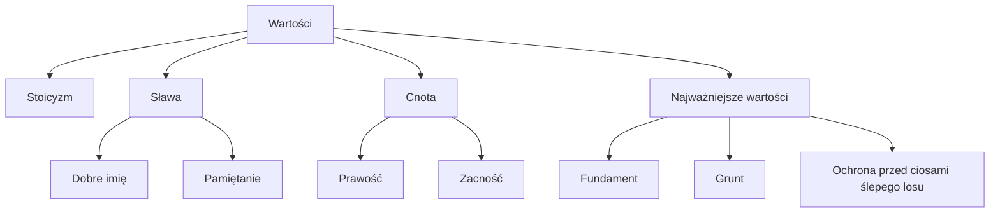

# Język Polski
## 2023-2024
### 13.11.2023
#### Treny Jana Kochanowskiego
##### Wartości Kochanowskiego

##### Kompozycja cyklu
- *Treny I-II* - przedmowa
- *Treny III-VIII* - wyrazy wzrastającego bólu
- *Treny IX-XI* - zwątpienie
- *Treny XII-XIV* - uzasadnienie zwątpienia
- *Treny XV-XVII* - szukanie ukojenia
- *Treny XIII-XIX* - uspokojenie
#### Zadanie
Napisać rozprawkę na temat: *Na czym w Trenie XI polega kryzys światopoglądowy Jana Kochanowskiego i jak jest przedstawiony?*
